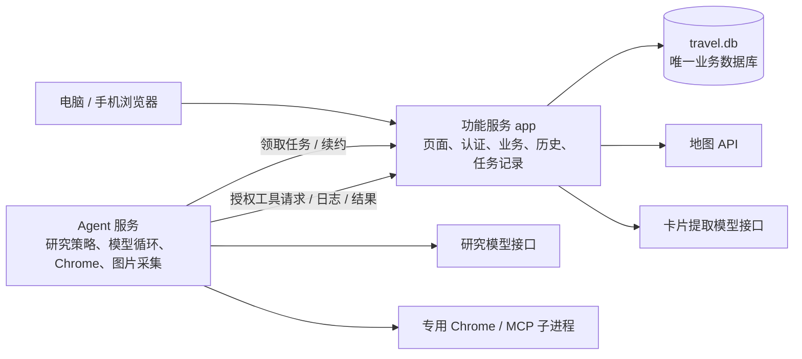

> 实施更新（2026-09-13）：双服务、本地安装器与 Docker 配置已实现。实际目录和运行方式以 `README.md`、`docs/deployment.md` 为准，回归与未验证项见 `docs/two-service-regression.md`。本文保留设计讨论；当前以短轮询、Agent 内存页面状态及功能服务持久化网关实现执行边界。

# 双服务拆分与部署改动计划

日期：2026-09-13。状态：具体实施分析，尚未修改运行代码或执行部署。

用户已确认：功能与 Agent 拆为两个独立服务；提供一键部署与 Docker 部署；本地和云端都支持，优先本地。一键部署按此前讨论指一条安装命令，Mac 原生安装为默认本地入口。

本文替代前期分析中的单进程建议。既有功能、规划策略、五个模型工具、数据权限和采用/撤销行为作为兼容基线。

## 1. 确定的目标架构

提供两个可独立构建、启动、停止和升级的进程：`app` 功能服务与 `agent` 执行服务。浏览器始终连接功能服务；Agent 是内部后台服务，不直接处理用户登录。



图中的模型、地图是外部 provider；Chrome 是 Agent 管理的子进程。产品自身部署两个服务。云端 HTTPS 代理可作为额外基础设施，不计作第三个业务服务。

| 职责 | 功能服务 app | Agent 服务 |
| --- | --- | --- |
| 页面、用户、会话、邀请、权限 | 完整拥有 | 不接受用户 Cookie，不创建用户 |
| 计划、笔记、卡片、准备事项 | 完整拥有 | 读取经授权的上下文，生成建议 |
| 提议模拟、采用、撤销 | 完整拥有，保留单事务 | 调用模拟接口，不执行采用 |
| 地图查询、资产、缓存和额度 | 完整拥有，供界面和 Agent 共用 | 通过受任务范围约束的接口查询 |
| 卡片自动提取 | 独立模型适配器，不依赖研究进程 | 不负责卡片业务 |
| 研究策略、提示词、上下文压缩 | 提供过滤后的事实快照与历史 | 决定研究步骤和送入模型的上下文 |
| 研究记录、提议、执行轨迹 | 权威持久化与读取、SSE | 生成并可靠提交 |
| 网页与图片 | 查询记录、证据归属、图片字节、授权读取 | Chrome 执行、图片下载与加工 |
| 队列、取消标记、预算回执 | 权威状态与原子校验 | 领取工作、执行、续约、响应取消 |
| Harness | 仅保留历史格式兼容验证组件 | 完整运行时、插件和驱动 |
| 本地文件 | 数据库、备份、应用配置 | 专用 Chrome profile、缓存、运行配置 |

这个划分允许 Agent 独立重启，功能服务及已保存资料继续可用。Agent 离线时，新研究、新网页采集和重新下载图片不可执行；已有图片仍可读，手动地图查询仍可用，卡片提取在自身模型已配置时仍可用。

## 2. 数据与任务通信的选择

### 数据库由功能服务独占

Agent 不挂载 `travel.db`，不导入 `Plans`、`better-sqlite3` 或业务 repository。研究的私人记录也由功能服务保存，包括原始 Harness 日志；数据名带 `agent_` 不代表必须放到 Agent 的数据库。

初期保持现有工作区、研究、地图、浏览器、媒体和 Harness 表在同一个 SQLite 中，避免拆库后破坏提议采用的事务与完整备份。SQLite WAL 同时只允许一个 writer，且依赖同机共享内存，不能把数据库文件通过网络盘共享给两个服务。[SQLite 官方说明](https://sqlite.org/wal.html)

这是本项目的架构选择，不是说 SQLite 不能被同机多个进程打开。采用单一业务写入方也让权限、迁移和恢复更容易保持一致。

### 使用持久任务队列和内部 HTTP

功能服务把研究记录与执行任务放在一个短事务中保存，然后返回现有 `202 + runId`。Agent 通过内部 HTTP 长轮询领取任务，再提交进度、工具请求与最终结果。初期不引入 Redis 或单独消息队列，SQLite 中的任务表就是持久队列。

相较于“先保存任务，再 POST 到 Agent”的两个步骤，领取模式消除了保存成功但派发失败的空档。网络断开可以重试领取或提交回执，但不能据此重放模型请求。

建议的监听范围，端口均可配置：

| 入口 | Mac 原生默认 | Docker |
| --- | --- | --- |
| app 公共页面/API | `127.0.0.1:4317`；显式启用局域网共享 | 映射 app 的 4317；本地默认只绑定宿主 loopback |
| app 内部任务/API | `127.0.0.1:4319`，独立监听器 | `app:4319`，不发布到宿主 |
| agent 运维健康入口 | `127.0.0.1:4318` | 仅容器内检查，不发布到宿主 |

内部监听器与公共监听器属于同一个 app 进程，共用业务服务和数据库。Agent 主要主动连接 app；它的健康入口不暴露业务或模型工具。

两种安装方式共用 HTTP 协议。服务鉴权凭据由安装器生成，通过受限配置文件传入；用户身份与工作区范围从已保存任务中解析，不信任 Agent 请求里的任意 `userId/workspaceId`。服务凭据也不能让工具绕过任务范围和权限校验。

### 第一版内部协议

下表为拟新增接口族，路径与字段在契约包中一次定义；不是已经存在的 API。

| 接口族 | 用途与约束 |
| --- | --- |
| `/internal/agent/v1/register`、`heartbeat` | 声明实例、协议、能力、代码与会话格式版本；兼容后才领取任务 |
| `/jobs/claim` | 原子领取任务，返回任务上下文和有有效期的执行凭据 |
| `/jobs/:id/renew` | 续约并返回取消标记；拒绝已失效实例 |
| `/jobs/:id/model-dispatches` | 发模型请求前预留次数与 token 阈值额度，保存调用回执 |
| `/jobs/:id/tools/context`、`maps`、`check-proposal` | 权限与租约检查后的领域工具；不开放任意 SQL/命令 |
| `/jobs/:id/browser-queries`、`artifacts`、`media` | 创建查询回执、提交证据与字节；核对引用、哈希和归属 |
| `/jobs/:id/events`、`usage` | 幂等追加产品进度和用量；不能覆盖历史日志 |
| `/jobs/:id/harness-session`、`harness-events` | 创建/读取本任务 Session，顺序追加完整日志并持久确认 |
| `/jobs/:id/output`、`complete` | 保存和检查产物；日志齐备后原子结算终态 |

每次有副作用的内部提交都包含稳定的 `operationId` 和内容摘要。相同 ID、相同内容返回原回执；相同 ID、不同内容返回冲突。新写入必须具有当前租约；已完成请求的精确重试在鉴权后可返回原回执，不再次写入。

图片与截图使用限定类型和大小的二进制上传，正文/事件有独立大小限制；超大日志采用明确分块和完整性校验。避免用普通 JSON 的 Base64 承担全部图片传输，也不为内部接口无限扩大公共 API 的 bodyLimit。

## 3. 跨进程后必须补齐的行为

### 租约、取消、崩溃和重试

当前 `running` Map、`AbortController` 和定时器只在一个进程有效，需要变为“功能服务记录执行资格，Agent 负责执行”的方式。

- 领取时保存实例 ID、租约随机标识、执行代次、到期时间和任务状态，事务内检查并发与每用户限制。
- 排队与执行截止时间也保存在 app，重连或续约不延长原运行限额；每个模型调用有独立 dispatch ID，用量按回执幂等汇总，不由 Agent 覆盖累计值。
- 可先以 5 秒续约、30 秒租约期做测试起点；具体值是待验收的配置，不能把网络延迟当作永久故障。
- 用户取消先写入 app。Agent 在续约和每次 dispatch 检查时获知并 abort，只释放本任务的浏览器会话。尚未执行的任务直接取消；执行中的保持 `cancelling`，直到确认收尾或租约过期。
- 失去 app 联系时，Agent 停止新模型和网页 dispatch，并中止可取消的在途操作。app 在租约过期后标记中断；失效实例恢复连接后不能用旧凭据写入。
- Agent 崩溃不会自动重跑已经开始的研究。保留资料，由用户“继续”创建新 run。领取前的排队任务可在原有效期限内继续等待。
- app 重启生成新的服务代次，使旧执行凭据失效；活动研究转为中断，未开始的队列按过期规则处理。恢复备份也必须更换代次，不能重新激活备份中的旧租约。

对模型提供商的请求不能保证严格“恰好一次”：进程可能在请求已发出、响应未记录时死亡。此时保留“可能已调用、用量未知”的记录，不自动重放，也不把未知费用显示为零。进程隔离不等于同一主机上的内存/磁盘故障隔离，需要限制 Agent 并发及容器资源。

### 日志、产物与采用

顺序为：持久保存必要请求信息 → 获得调用许可 → 发出模型/工具请求 → 保存所得证据和产物 → flush 完整 Harness 日志 → app 检查租约、权限及产物后结算。

`publish_result` 仍只提交研究结果，不能改正式计划。app 可以先保存可恢复的产物草稿，但只有完整验证和日志结算通过后，才发布完成事件及可采用提议。用户采用时在 app 内再次检查版本与权限，在原有单个事务里写计划、成员、来源、提议状态、修改历史和幂等回执。

公开 SSE 继续由 app 从已保存事件提供，保留 Last-Event-ID/序号恢复。浏览器无需连接第二个服务，也不会在 Agent 重启后失去已提交的历史。

## 4. 按现有文件划分的修改清单

| 现有位置 | 具体调整 | 工作性质 |
| --- | --- | --- |
| `src/agent/service.ts` | 拆成 app 的 ResearchService/TaskCoordinator/RunStore 与 agent 的运行器、上下文、提示词、工具适配 | 大：职责与异步流程重构 |
| `src/agent/proposals.ts` | `prepare/insert/view/apply/published` 移入功能提议服务；输出协议放 contracts | 中：迁移并保留事务行为 |
| `src/service/server/app.ts` | 不再构造 AgentService、BrowserService 或依赖 Harness；装配研究记录服务、远程执行入口、独立卡片提取；增加内部监听器 | 大：应用装配变更 |
| `src/service/server/main.ts` | 作为 app 的唯一入口，负责配置、迁移、锁、两个监听器和优雅关闭 | 中 |
| `src/service/server/agent.ts` | 公共研究接口保留 URL，转向本地记录/任务服务；拆出媒体、来源和轨迹路由 | 中 |
| `src/service/domain/plans.ts` | 图片/空间授权与校验转入功能资产接口；保留命令、版本和撤销规则 | 中 |
| `src/agent/browser/service.ts` | Chrome 与页面操作进入 Agent；将同步 BrowserStore 调用改为可等待的存储端口，恢复由 app 租约负责 | 大 |
| `src/agent/browser/store.ts` | SQLite 查询与证据存储移入 app repository；`digest` 移公共纯工具 | 中 |
| `src/agent/browser/chrome.ts`、`config.ts` | 由 Agent 管理专用 profile、可执行文件、受限来源与进程清理 | 中 |
| `src/service/server/browser.ts` | 历史查询仍读本地 DB；新浏览器操作生成执行任务；断开与取消仅针对对应会话 | 中 |
| `src/agent/media.ts` | 拆成 app 的 MediaRepository/授权/读取与 Agent 的下载/加工/采集；重试改成有回执的执行任务 | 大 |
| `src/agent/trajectory.ts` | 轨迹查询、分页、脱敏和导出归 app；不依赖正在运行的 Harness | 中 |
| `src/maps/*`、server/maps | 留在 app；给内部研究工具增加任务权限和额度检查，界面请求保持原接口 | 中 |
| `src/cards/import.ts`、server/cards | 保留 app；提取接口独立注入，不从 AgentDriver 取方法 | 小至中 |
| `config/harness/travel/driver.mjs` | 仅研究驱动；请求许可和日志回调变为可等待操作，提取能力迁出 | 大 |
| `config/harness/travel/persistence.mjs` | 从直连 DB 的 provider 改为内部日志 API 适配；保留顺序、单 writer 与 flush 语义 | 大 |
| `config/harness/travel/resources.mjs`、`app.mjs` | 移除 DB/Plans/Auth/地图/公共 Fastify 所有权，改为 Agent 运行资源和启动插件 | 大 |
| `scripts/start-agent.mjs` | 不再决定启动哪个业务宿主；拆出两个进程入口和安装后的管理 CLI | 中 |
| `scripts/prepare-harness-app.mjs`、`modules.mjs`、vendor lock | 固定获取和构建，入口改包解析/相对路径，生成可分发产物与完整依赖清单 | 大 |
| `src/storage/database.ts` | 增量迁移加入任务、租约、服务代次、幂等回执与预算记录 | 中 |
| `src/storage/*backup.ts`、maintenance | 更新表白名单和新增关系验证；历史日志验证器随 app 发布；恢复使租约失效 | 大 |
| `src/storage/runtime-lock.ts` | app 独占数据目录，Agent 独立 profile 锁；Docker 维护通过服务/运维入口停止后执行 | 中 |
| `src/service/client/AgentPanel.tsx`、App、api | 服务状态与能力降级、取消/中断反馈；保留原公共接口；状态恢复后可重新研究 | 中 |
| `src/shared/*`、package/tsconfig/Vite | 提取契约与公共模型，建立独立工作区构建和禁止跨包内部导入规则 | 中 |
| `tests/agent*.test.ts`、browser/media/backup tests、runtime scripts | 本地单进程 fixture 拆成单元与真实双进程测试，覆盖下面的故障矩阵 | 大 |

最容易漏掉的异步改动：`DriverInput.beforeModel()` 目前返回 void，Harness 驱动直接调用后就发模型请求；`request/usage` 也是同步回调。需要改为等待许可/持久确认，或由有序追加队列提供明确 flush 屏障。浏览器 `start/begin/finish/get` 的同步接口也不能简单替换为返回 Promise 而不改调用链。

研究工具保持现有五个名字：`read_plan_context`、`read_map_data`、`read_travel_source`、`check_plan_draft`、`publish_result`。调整其执行适配器，先不改变提示词策略和工具业务含义，便于比较迁移前后行为。

## 5. 容易产生歧义的边界

**卡片自动提取**：直接从 HarnessDriver 移出，使用独立 `CardExtractor` 和模型客户端。代码中的 provider 通信、超时与脱敏可共用库；两个服务各自创建客户端和持有明确用途的凭据。研究预算与卡片预算分开记录，不能声称拆开后具有跨服务的精确总费用上限。

**手动浏览器功能**：公共浏览器 API 的历史读取继续可用，新操作进入 Agent 的独立执行队列。研究和手动浏览器任务有独立的会话归属；涉及已有 pageId 的动作只交给持有该页面的 Agent 实例。实例退出后页面句柄失效，返回“页面会话已结束”，历史正文与截图不丢失。

**浏览器 CLI/MCP**：应用集成模式应使用应用接口；现有独立诊断模式可以保留自己的隔离数据目录，不得再读取正在使用的应用 DB。用户级客户端不能拿到服务间全局凭据。相关说明与测试要随迁移更新。

**Agent 独立优化**：能够改提示词、驱动、浏览器执行和上下文策略后只重启 Agent；新版本需与 app 内部协议和日志格式兼容。不兼容时拒绝领取任务并在界面显示升级提示，不能依靠两个仓库碰巧同步。第一版仍用同仓库和配对发布清单，但允许安装兼容的新 Agent 版本。

**应用备份**：即使关闭 Agent，也能备份恢复已保存的研究、图片、来源和历史。仅包含已被 app 确认保存的数据，不承诺保存 Agent 内存中尚未提交的片段。Chrome 登录配置和 provider 密钥继续独立，不进入数据库备份。

## 6. 目标目录与独立开发入口

```text
apps/
  web/                       正式 React 页面
  app/                       功能服务入口、公共与内部 HTTP
  agent/                     Agent 进程入口、任务领取与运行
packages/
  contracts/                 用户协议、内部协议、领域/研究/资产模型
  core/                      领域操作与功能用例，含研究记录和提议采用
  storage/                   SQLite、迁移、备份；仅 app 使用
  agent-runtime/             策略、上下文、提示词、工具、Harness 驱动
  browser/                   Chrome 执行与异步证据端口
  llm/                       provider 通信及独立卡片提取适配
  archive-compat/            固定历史日志格式校验，不加载 Agent 循环
  common/                    无业务副作用的哈希、规范化等工具
deploy/
  macos/                     原生安装与两个 LaunchAgent 模板
  docker/                    两个镜像、基础/云端/源码构建配置
scripts/release/              原生产物、Harness 打包、校验清单
tests/integration/           双进程、断线、恢复、协议与安装验收
.github/workflows/           分服务检查、发布产物和镜像
```

正式包数量可在搬迁时合并小目录，边界规则必须保留：Agent 运行包不能依赖 storage/core 实现，app 不加载 agent-runtime，前端不能导入服务端/框架模块。根工作区负责开发依赖安装和集成检查，发布时分别裁剪 app 与 Agent 的运行依赖。

拟新增开发命令：`dev:app`、`dev:agent`、`dev:web`，以及 `build:app`、`build:agent`、`test:app`、`test:agent`、`test:integration`。保留根级 check/build/test 作为组合入口。正式前端使用 Vite HMR 与 app API 代理，原型开发命令继续独立。

功能测试使用假执行器，Agent 测试使用假的应用工具客户端；真实双进程测试才验证网络协议。测试不要重新把两个服务装回同一 createApp fixture 后声称进程隔离通过。

## 7. 数据迁移与版本

以当前 v7 为起点，预计新增 v8（若实施前有其他迁移则顺延）。保留旧表和数据，新增拟议的 `execution_jobs`、实例/租约元数据、调用许可和内部提交回执；研究任务与 run、浏览器任务与 query、媒体任务与 asset 分别关联并校验。

不改写旧 proposal digest、历史上下文、媒体 ID 或来源内容。迁移前停止旧执行并创建一致性备份，已有活动任务转为中断；未完成任务不自动转交新进程付费重跑。

备份校验目前严格比较整张表清单，新增表后必须同步更新 `maintenance.ts`，以及任务归属、日志序号、租约与回执关系验证。旧 v1—v7 备份继续沿用迁移路径；新备份只由兼容版本恢复。

独立进程不能靠删除 `.app.lock` 来实现。app 保持唯一数据库所有者；Agent 仅锁自己的浏览器目录。现有锁使用 PID，在容器维护场景要避免跨 PID 命名空间误判；在线备份走 app，恢复先停止 app/Agent，再由受控维护命令获取独占权。

## 8. Mac 原生一键部署

新增安装器与 `travel` 管理命令，不要求使用者编译源码。安装器完成：

1. 检查 macOS、CPU、可写目录、端口和网络，下载匹配架构的固定发布包并校验。
2. 准备独立 Node 运行时、两个服务产物、原生依赖和已构建 Harness，不依赖全局 Node/pnpm。
3. 检测兼容 Chrome；缺失时自动准备经过平台验证的独立浏览器包。若该平台没有兼容产物或系统要求人工授权，安装器明确报告；基础功能可先启动，但不能把缺浏览器的状态标为完整研究可用。
4. 在用户应用支持目录分开建立 `releases/config/data/agent-runtime/logs/backups`，生成服务凭据和一次性管理员初始化凭据。
5. 安装两个用户级 LaunchAgent，使用绝对可执行路径和显式环境；启动、健康检查并显示页面地址。用户级服务在登录后运行，注销会停止。[Apple launchd 说明](https://developer.apple.com/library/archive/documentation/MacOSX/Conceptual/BPSystemStartup/Chapters/CreatingLaunchdJobs.html)
6. 重复安装保留配置和数据库，失败回到原可用版本。识别已有安装；现有数据可能位于 `.cache` 下，不能默认迁移 `data/` 或让用户误以为旧资料丢失。使用明确的数据来源参数和备份恢复流程导入。

`travel status/start/stop/restart/logs/update/backup/restore` 统一管理，可指定 `app` 或 `agent`。升级 Agent 可先停止领取任务，等待当前任务结束；强制重启则按中断规则处理。app 升级涉及迁移时先停止执行并备份。

“一键”不意味着自动取得模型密钥、免除系统授权或保证电脑睡眠后仍服务。无密钥可完成基础安装；模型和地图能力在设置中说明未配置。第一版不增加桌面壳应用，避免把服务拆分扩大成桌面产品开发。

## 9. Docker 部署与云端配置

两个运行镜像分别包含 app 与 Agent 的必要依赖：app 包含前端、SQLite 和归档兼容组件；Agent 包含 Harness、浏览器及执行依赖。macOS node_modules 不能复制进 Linux 镜像。

基础 Compose 只部署 `app` 与 `agent`。业务数据卷只挂 app；Agent 有独立 profile/cache 卷。公共端口只发布 app；内部通信仍需鉴权。服务间密钥可以通过 Compose secrets 文件按需提供。[Docker secrets 文档](https://docs.docker.com/compose/how-tos/use-secrets/)

建议提供基础、本地局域网、云端 HTTPS 和源码构建配置。部署配置取得后目标命令为 `docker compose up -d`；首次从空目录安装时由版本化安装器自动取得配置、生成凭据和数据目录后调用 Compose。云端另需域名/DNS与可用证书，不能把这些条件隐藏在“一键”中。

app 的 ready 只检查自身数据库与必要资源，不等待模型或 Agent。Agent 等 app 健康后接入，但也必须能在运行中断线重连；`depends_on` 只能控制启动条件，不能代替业务恢复逻辑。[Docker 启动顺序文档](https://docs.docker.com/compose/how-tos/startup-order/)

两个容器都处理 SIGTERM 和超时收尾，Agent 正确清理 MCP/Chrome 子进程。为 Agent 设置合理 CPU、内存与并发限制，防止主机资源耗尽连带影响 app。记录服务版本、协议版本和就绪原因，不用真实模型请求做健康检查。

Docker 与原生安装都要替换现有的 loopback-only 首次注册判断，使用一次性安装凭据；云端补受信代理、Secure cookie、对外 URL、来源检查及 SSE 超时/缓冲设置。禁止仅打开 `trustProxy=true` 或无条件远程注册来绕过现有检查。

Linux amd64 与 arm64 必须分别完成 Chrome >=149 行为、原生模块和备份恢复验证后才声明支持。Mac 原生 arm64 优先，Intel 发布包独立验收。Node 发布包采用通过兼容测试的固定 LTS 补丁版本；目前 Node 25.8.1 只是现有开发测试环境，不直接作为长期发布承诺。[Node 发布说明](https://nodejs.org/en/about/previous-releases)

## 10. GitHub 与可复现发布

新增源码检查、两个服务的构建测试、Mac 原生产物构建、Linux 镜像构建、发布验收工作流。固定 Harness Git SHA、包管理器、依赖锁文件与所有运行资产，运行时不需要 `.git` 或开发机 `.cache/harness-artifacts.json`。

版本发布清单应记录 app 版本、Agent 版本、协议范围、数据库版本、Harness/日志版本、CPU 架构与校验摘要。发布配对默认版本，也为单独升级 Agent 提供兼容判断。

GitHub 仓库放源码与安装说明，Release 放 Mac 安装器和架构包，GHCR 放两个镜像。提交前整理 `output/tmp/docs/qa` 的真实资料，补 `.dockerignore`，保留必要测试夹具与上游声明。当前仓库仍无提交、无 remote；仓库账号、名称、可见性和许可证在首次创建发布时明确。

## 11. 分阶段落地与验收门槛

| 阶段 | 具体交付 | 退出条件 |
| --- | --- | --- |
| A：恢复构建基线与确定契约 | 修复现有测试夹具类型错误；建立包边界；任务/日志/工具协议 | check 和现有功能测试通过；协议可独立编译 |
| B：抽离功能所有权 | 提议事务、研究历史、媒体存储、轨迹、卡片提取、app 独立入口 | 无 Harness 执行进程时，手动功能与历史/采用/撤销/备份可用 |
| C：双进程最小闭环 | 持久任务、领取/续约/取消、异步 driver hook、远程 Harness 日志；先使用假模型 | 分别启动两个真实进程，完成提交/记录/结果/采用；杀 Agent 后 app 继续读写 |
| D：完整执行能力 | 固定 Harness、五工具、地图、Chrome、媒体和独立浏览器入口 | 已有研究/资料行为兼容，凭据/范围/并发规则及失败矩阵通过 |
| E：安装与容器 | Mac 安装器、双 LaunchAgent、维护 CLI、双镜像、初始化与持久卷 | 干净环境安装、重复安装、单服务重启、升级、备份恢复通过 |
| F：双环境发布 | 云端 HTTPS、架构矩阵、GitHub 源码与产物 | 另一环境按文档部署成功，服务/镜像/协议版本可核对 |

首个技术验证重点是 C 中的“预算许可与远程日志 flush”：使用真实固定版本 Harness 的假 provider 验证异步持久语义，避免先写完整安装器后才发现框架适配不成立。

必要的新增集成验收包括：

- Agent 关闭时，app 登录、计划编辑、地图、笔记、图片、已保存研究、提议采用/撤销与备份均正常；卡片提取单独配置后可运行。
- 分别在任务领取、模型请求许可、资料保存、产物提交和完成响应阶段断线/杀进程；重试不重复写入，不自动重发不确定的模型调用。
- 取消与完成同时到达、旧实例迟到结果、租约过期后恢复连接、权限被撤销：由 app 的事务决定合法结果，旧写入不能覆盖新状态。
- 旧协议 Agent 无法领取新任务；兼容升级仅重启 Agent 后 app 仍可使用。
- 日志顺序、内容摘要、重复提交与缺块检查有效；界面只有在完整提交后显示完成。
- v7 数据迁移和旧备份恢复后，计划、媒体引用、提议摘要与历史不被改写；恢复后不执行备份中的旧任务。
- 原生安装和 Docker 中均测试持久化、端口冲突、缺浏览器/密钥、服务重启、备份与还原；云端另测 HTTPS 登录和 SSE。

单元测试继续使用确定性夹具；真实模型只用于单独的研究质量验证。双进程功能正确与模型研究质量是两个验收维度。

## 12. 本轮分析依据与范围

本轮重新核对了启动链、研究状态机、五工具、模型调用 hook、Chrome/媒体存储、Harness persistence、数据库/恢复规则与前端接口。另检查当前安装依赖声明：better-sqlite3、sharp、Chrome DevTools MCP、undici、pdfjs-dist 和 Harness 的 Node 范围允许选择合适的 LTS 版本，但尚未执行该版本的构建与运行验证。

此前同日基线为 153 项测试和 16 项原型交互检查通过；类型检查在 `tests/notebook-layout.test.ts:20` 存在 WorkspaceView 缺字段错误。此次仅修改方案文档，没有改变运行源码，因此未重复执行同一套测试，没有调用真实模型、启动新服务、迁移数据或写入 GitHub。

这次工作量主要集中在有序持久化、任务恢复和浏览器存储异步化，目录迁移与安装脚本是其后的工作。现有页面、业务模型、领域操作和大部分确定性测试可以保留。
